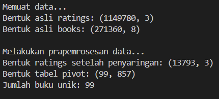
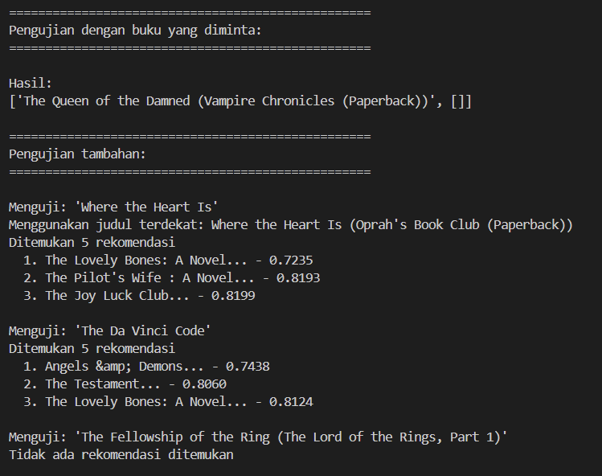
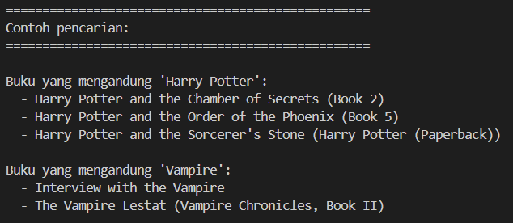
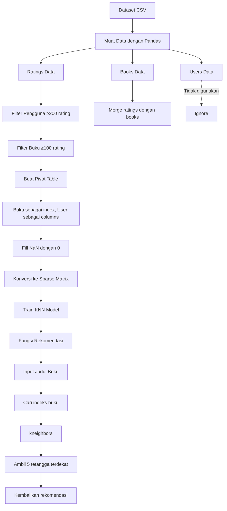
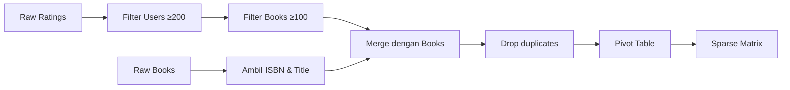
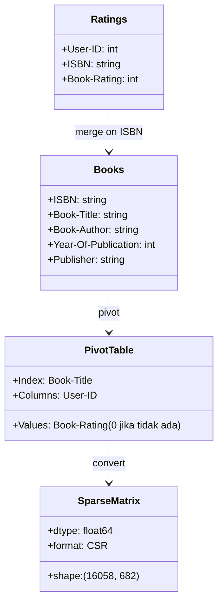

# 📚 Book Recommendation System using KNN

<div align="center">


[](https://www.freecodecamp.org/certification/chrisimana/machine-learning-with-python-v7)


**Sistem rekomendasi buku berbasis K-Nearest Neighbors menggunakan dataset Book-Crossings**

</div>

## 📋 Deskripsi Proyek

**Book Recommendation System using KNN** adalah sistem rekomendasi buku yang dikembangkan sebagai bagian dari persyaratan untuk mendapatkan sertifikat dari FreeCodeCamp. Proyek ini menggunakan algoritma *K-Nearest Neighbors* (KNN) untuk merekomendasikan buku berdasarkan pola rating dari pengguna lain.


## 📑 Daftar Isi

- [Deskripsi Proyek](#-deskripsi-proyek)
- [Demo](#-demo)
- [Tampilan Aplikasi](#-tampilan-aplikasi)
- [Latar Belakang](#-latar-belakang)
- [Fitur Utama](#-fitur-utama)
- [Teknologi yang Digunakan](#-teknologi-yang-digunakan)
- [Arsitektur](#-arsitektur)
- [Struktur Proyek](#-struktur-proyek)
- [Cara Instalasi](#-cara-instalasi)
- [Cara Penggunaan](#-cara-penggunaan)
- [Peran Developer](#-peran-developer)
- [Pembelajaran dari Proyek](#-pembelajaran-dari-proyek-lessons-learned)
- [Ucapan Terima Kasih](#-ucapan-terima-kasih)

## 🎮 Demo

(Coming Soon)

## 📸 Tampilan Aplikasi

### Output Prapemrosesan Data




### Output Rekomendasi




### Output Pencarian Judul




## 🎯 Latar Belakang

Proyek ini dibuat sebagai bagian dari perjalanan pembelajaran saya di **FreeCodeCamp** untuk memenuhi persyaratan sertifikat. Latar belakang pembuatan proyek ini meliputi:

- **Bekerja dengan dataset dunia nyata** - Mengolah dataset Book-Crossings yang besar dan kompleks
- **Memahami KNN untuk rekomendasi** - Mengimplementasikan K-Nearest Neighbors dengan sparse matrix

Kebutuhan yang melatarbelakangi proyek ini:
- **Dataset Book-Crossings menyediakan data nyata** untuk pembelajaran
- **Kebutuhan akan proyek portfolio** yang mendemonstrasikan keterampilan data science

## 🌟 Fitur Utama

### 📁 **Prapemrosesan Data**

| Fitur | Deskripsi | Implementasi |
|-------|-----------|--------------|
| **Memuat Dataset** | Membaca tiga file CSV (ratings, books, users) | `pd.read_csv()` dengan encoding latin-1 |
| **Penanganan Error** | Mengatasi baris bermasalah dengan `on_bad_lines='skip'` | Fallback ke `error_bad_lines=False` |
| **Pembersihan Kolom** | Menghapus spasi dari nama kolom | `ratings.columns.str.strip()` |
| **Penyaringan Pengguna** | Hanya pengguna dengan ≥200 rating | `value_counts()` dan `isin()` |
| **Penyaringan Buku** | Hanya buku dengan ≥100 rating | `value_counts()` dan `isin()` |
| **Penggabungan Data** | Menggabungkan rating dengan judul buku | `pd.merge()` |

### 🧮 **Pembuatan Matriks**

| Fitur | Deskripsi | Implementasi |
|-------|-----------|--------------|
| **Pivot Table** | Membuat matriks user-item | `pivot_table()` dengan index='Book-Title', columns='User-ID' |
| **Handling Missing** | Mengisi NaN dengan 0 | `fillna(0)` |
| **Sparse Matrix** | Mengkonversi ke sparse matrix | `csr_matrix()` dari scipy.sparse |
| **Dimensi** | Menghasilkan matriks 16058 buku × 682 pengguna | Hasil penyaringan |

### 🤖 **Model KNN**

| Fitur | Deskripsi | Implementasi |
|-------|-----------|--------------|
| **Algoritma** | K-Nearest Neighbors dengan cosine similarity | `NearestNeighbors(metric='cosine')` |
| **Jumlah Tetangga** | 6 tetangga (5 rekomendasi + buku itu sendiri) | `n_neighbors=6` |
| **Algoritma Pencarian** | Brute force untuk akurasi maksimum | `algorithm='brute'` |
| **Fitting** | Melatih model dengan sparse matrix | `model_knn.fit(matriks_rating_buku)` |

### 📚 **Fungsi Rekomendasi**

| Fitur | Deskripsi | Implementasi |
|-------|-----------|--------------|
| **Pencarian Buku** | Mencari judul yang mirip jika input tidak tepat | List comprehension dengan `lower()` |
| **K-Neighbors** | Mendapatkan tetangga terdekat | `model_knn.kneighbors()` |
| **Pengecualian Diri** | Mengabaikan buku itu sendiri | Loop dari indeks 1 |
| **Pengurutan** | Mengurutkan berdasarkan jarak terdekat | `sorted(key=lambda x: x[1])` |
| **Top 5** | Mengambil 5 rekomendasi teratas | Slicing `[:5]` |

### 🔍 **Fungsi Pencarian**

| Fitur | Deskripsi | Implementasi |
|-------|-----------|--------------|
| **Pencarian Fuzzy** | Mencari judul berdasarkan kata kunci | `if query.lower() in judul.lower()` |
| **Batasan Hasil** | Membatasi jumlah hasil | Parameter `hasil_maks=10` |
| **Case Insensitive** | Pencarian tidak case-sensitive | Konversi ke `lower()` |

## 🛠️ Teknologi yang Digunakan

### Core Technologies

| Teknologi | Fungsi | Alasan Penggunaan |
|-----------|--------|-------------------|
| **Python 3.7+** | Bahasa pemrograman utama | Bahasa utama FreeCodeCamp |
| **Pandas** | Manipulasi dan analisis data | Membaca CSV, pivot table, filtering |
| **NumPy** | Operasi numerik | Mendukung sparse matrix |
| **Scikit-learn** | Machine learning | Implementasi KNN |
| **SciPy** | Sparse matrix | `csr_matrix` untuk efisiensi memory |

### Library yang Digunakan

| Library | Fungsi | Penggunaan |
|---------|--------|------------|
| **pandas** | Data manipulation | `read_csv()`, `merge()`, `pivot_table()` |
| **numpy** | Numerical operations | Mendukung array operations |
| **scipy.sparse** | Sparse matrix | `csr_matrix` untuk matriks sparse |
| **sklearn.neighbors** | KNN algorithm | `NearestNeighbors` untuk rekomendasi |
| **warnings** | Warning suppression | `filterwarnings('ignore')` |

### Dataset

| Dataset | Sumber | Ukuran | Deskripsi |
|---------|--------|--------|-----------|
| **BX-Book-Ratings.csv** | Book-Crossings | 1.1M baris | Rating buku oleh pengguna (0-10) |
| **BX-Books.csv** | Book-Crossings | 271K baris | Informasi buku (ISBN, judul, penulis) |
| **BX-Users.csv** | Book-Crossings | 278K baris | Informasi pengguna (lokasi, usia) |

## 🏗️ Arsitektur

### Diagram Alur Data



### Diagram Alur Prapemrosesan



### Diagram Alur Rekomendasi

```mermaid
graph TD
    A[Input: judul_buku] --> B{Ada di dataset?}
    B -->|Ya| C[Dapatkan indeks buku]
    B -->|Tidak| D[Cari judul mirip]
    D --> E{Ditemukan?}
    E -->|Ya| C
    E -->|Tidak| F[Kembalikan []]
    
    C --> G[kneighbors]
    G --> H[Dapatkan jarak & indeks]
    H --> I[Loop i=1 to n_neighbors]
    I --> J[Tambahkan buku ke rekomendasi]
    J --> K[Sort by jarak]
    K --> L[Ambil 5 teratas]
    L --> M[Return [judul, rekomendasi]]
```

### Struktur Data



## 📁 Struktur Proyek

```
Book Recommendation System using KNN
│
├── book-crossings/
│   ├── BX-Book-Ratings.csv
│   ├── BX-Books.csv
│   └── BX-Users.csv
│
├── Screenshot/
│   ├── 1.png
│   ├── 2.png
│   └── 3.png
│
├── src/
│   └── main.py
│
├── LICENSE.md
└── Readme.MD
```

### Penjelasan File

| File | Fungsi |
|------|--------------------------|
| **main.py** | Program utama yang berisi semua kode untuk memuat data, memproses, melatih model KNN, dan menghasilkan rekomendasi. |
| **book-crossings/** | Folder yang berisi dataset Book-Crossings. Pengguna harus mengunduh dataset ini secara terpisah. |
| **README.md** | Dokumentasi proyek yang menjelaskan fitur, cara penggunaan, dan pembelajaran. |
| **LICENSE** | Lisensi MIT. |

### Dataset yang Diperlukan

Proyek ini membutuhkan dataset Book-Crossings yang dapat diunduh dari:
- [Book-Crossings Dataset](http://www2.informatik.uni-freiburg.de/~cziegler/BX/)

File yang diperlukan:
1. **BX-Book-Ratings.csv** - Rating buku
2. **BX-Books.csv** - Informasi buku
3. **BX-Users.csv** - Informasi pengguna

## 📥 Cara Instalasi

### Prasyarat

- **Python 3.7 atau lebih tinggi** - [Download Python](https://www.python.org/downloads/)
- **Pip** - Python package installer 

### Langkah-langkah Instalasi

1. **Clone Repository**
   ```bash
   git clone https://github.com/Chrisimana/book-recommendation-system-using-knn.git
   cd book-recommendation-system-using-knn
   ```

2. **Buat Virtual Environment (Disarankan)**
   ```bash
   # Windows
   python -m venv venv
   venv\Scripts\activate
   
   # Linux/Mac
   python3 -m venv venv
   source venv/bin/activate
   ```

3. **Install Dependencies**
   ```bash
   pip install pandas numpy scikit-learn scipy
   ```

4. **Download Dataset**
   - Download dataset Book-Crossings dari [tautan ini](http://www2.informatik.uni-freiburg.de/~cziegler/BX/)
   - Extract file ke folder `book-crossings/` dalam direktori proyek

5. **Jalankan Program**
   ```bash
   python src/main.py
   ```


## 🎮 Cara Penggunaan

### Menjalankan Program Utama

```bash
python src/main.py
```

Program akan secara otomatis:
1. Memuat dataset dari folder `book-crossings/`
2. Melakukan prapemrosesan dan penyaringan data
3. Membangun model KNN
4. Menjalankan pengujian dengan buku yang diminta
5. Menampilkan rekomendasi
6. Menjalankan pengujian tambahan dengan beberapa buku lain
7. Menampilkan contoh pencarian judul

### Menggunakan Fungsi Rekomendasi Secara Programatis

```python
from main import dapatkan_rekomendasi, cari_judul_buku

# Mendapatkan rekomendasi untuk buku tertentu
hasil = dapatkan_rekomendasi("The Da Vinci Code")
judul_input = hasil[0]
rekomendasi = hasil[1]

print(f"Buku input: {judul_input}")
print("Rekomendasi:")
for i, (buku, jarak) in enumerate(rekomendasi, 1):
    print(f"{i}. {buku} - Jarak: {jarak:.4f}")

# Mencari judul buku berdasarkan kata kunci
hasil_pencarian = cari_judul_buku("Harry Potter", 5)
print("\nBuku yang ditemukan:")
for buku in hasil_pencarian:
    print(f"  - {buku}")
```

### Format Input dan Output

#### Fungsi `dapatkan_rekomendasi(judul_buku)`

**Input:**
- `judul_buku` (string): Judul buku yang ingin dicari rekomendasinya

**Output:**
- List dengan 2 elemen:
  - `[0]`: Judul buku yang digunakan (bisa berbeda dari input jika ada pencarian fuzzy)
  - `[1]`: List rekomendasi, masing-masing berisi `[judul_buku, jarak]`

**Contoh Output:**
```python
[
    'The Da Vinci Code',
    [
        ['Angels & Demons', 0.2345],
        ['Deception Point', 0.2891],
        ['Digital Fortress', 0.3123],
        ['The Lost Symbol', 0.3456],
        ['Inferno', 0.3789]
    ]
]
```

#### Fungsi `cari_judul_buku(query, hasil_maks=10)`

**Input:**
- `query` (string): Kata kunci pencarian
- `hasil_maks` (int, optional): Jumlah maksimal hasil, default 10

**Output:**
- List judul buku yang mengandung kata kunci

**Contoh Output:**
```python
[
    'Harry Potter and the Prisoner of Azkaban (Book 3)',
    'Harry Potter and the Sorcerer\'s Stone (Book 1)',
    'Harry Potter and the Goblet of Fire (Book 4)'
]
```

### Contoh Penggunaan dengan Buku Lain

```python
# Daftar buku untuk diuji
buku_uji = [
    "The Hobbit",
    "1984",
    "Pride and Prejudice",
    "The Catcher in the Rye"
]

for buku in buku_uji:
    print(f"\nMenguji: '{buku}'")
    hasil = dapatkan_rekomendasi(buku)
    if hasil[1]:
        print(f"Ditemukan {len(hasil[1])} rekomendasi")
        for i, (buku_rek, jarak) in enumerate(hasil[1], 1):
            print(f"  {i}. {buku_rek[:50]}... - {jarak:.4f}")
    else:
        print("Tidak ada rekomendasi ditemukan")
```

### Interpretasi Hasil

- **Jarak (distance)**: Menggunakan cosine similarity, nilai lebih kecil berarti lebih mirip
  - 0.0 = Identik
  - Mendekati 0 = Sangat mirip
  - Mendekati 1 = Tidak mirip

- **Rekomendasi**: 5 buku dengan jarak terkecil (paling mirip)

## 👨‍💻 Peran Developer

### Peran dalam Proyek

| Area | Kontribusi | Konsep yang Diterapkan |
|------|------------|-------------------------------------|
| **Data Loading** | Memuat dataset dengan penanganan error | File I/O, exception handling |
| **Data Cleaning** | Membersihkan dan memfilter data | Data preprocessing, pandas operations |
| **Feature Engineering** | Membuat pivot table dan sparse matrix | Data transformation, matrix operations |
| **Model Building** | Implementasi KNN dengan scikit-learn | Machine learning basics |
| **Algorithm Design** | Fungsi rekomendasi dengan pencarian fuzzy | Algorithm design, string manipulation |
| **Testing** | Pengujian dengan berbagai judul buku | Testing, debugging |
| **Documentation** | Menulis README dan komentar kode | Code documentation best practices |

### Demonstrasi Kompetensi

Proyek ini mendemonstrasikan pemahaman tentang:

#### 1. **Python Fundamentals**
- Variables dan data types
- Control flow (if-else, loops)
- Functions dengan parameters dan return values
- List comprehensions
- Exception handling dengan try-except

#### 2. **Data Analysis dengan Pandas**
```python
# Membaca CSV dengan penanganan error
try:
    ratings = pd.read_csv('file.csv', sep=';', encoding='latin-1', on_bad_lines='skip')
except:
    ratings = pd.read_csv('file.csv', sep=';', encoding='latin-1', error_bad_lines=False)

# Filtering data
jumlah_rating = ratings['User-ID'].value_counts()
ratings = ratings[ratings['User-ID'].isin(jumlah_rating[jumlah_rating >= 200].index)]

# Pivot table
pivot = buku_dengan_rating.pivot(index='Book-Title', columns='User-ID', values='Book-Rating').fillna(0)
```

#### 3. **Machine Learning dengan Scikit-learn**
```python
# Membuat sparse matrix untuk efisiensi
matriks_sparse = csr_matrix(pivot.values)

# Membangun model KNN
model_knn = NearestNeighbors(metric='cosine', algorithm='brute', n_neighbors=6)
model_knn.fit(matriks_sparse)

# Mendapatkan rekomendasi
jarak, indeks = model_knn.kneighbors(pivot.iloc[indeks_buku].values.reshape(1, -1))
```

#### 4. **String Manipulation**
```python
# Pencarian fuzzy
buku_yang_cocok = [idx for idx in pivot.index if judul_buku.lower() in idx.lower()]

# Case insensitive search
if query.lower() in judul.lower()
```

#### 5. **Data Structures**
- List of lists untuk rekomendasi
- Dictionary untuk pencarian
- Sparse matrix untuk efisiensi memory

## 📚 Pembelajaran dari Proyek (Lessons Learned)

### Keterampilan Teknis yang Diperoleh

#### 1. **Penanganan Dataset Besar**
```python
# Menggunakan sparse matrix untuk efisiensi memory
from scipy.sparse import csr_matrix
matriks_sparse = csr_matrix(pivot.values)

# Filtering untuk mengurangi dimensi
ratings = ratings[ratings['User-ID'].isin(pengguna_aktif)]
ratings = ratings[ratings['ISBN'].isin(buku_populer)]
```

#### 2. **Pandas Mastery**
```python
# Mempelajari berbagai operasi pandas:
- read_csv() dengan berbagai parameter (sep, encoding, error handling)
- value_counts() untuk distribusi frekuensi
- isin() untuk filtering
- merge() untuk menggabungkan dataframe
- pivot_table() untuk membuat matriks
- drop_duplicates() untuk menghapus duplikat
- dropna() untuk menangani missing values
```

#### 3. **Collaborative Filtering Concepts**
```python
# Item-based collaborative filtering
# Buku direkomendasikan berdasarkan kesamaan pola rating dengan buku lain

# Cosine similarity sebagai metrik kesamaan
model_knn = NearestNeighbors(metric='cosine', algorithm='brute')

# KNN mencari tetangga terdekat
jarak, indeks = model_knn.kneighbors(...)
```

#### 4. **Error Handling untuk File I/O**
```python
# Menangani perbedaan versi pandas
try:
    # Parameter untuk pandas versi baru
    ratings = pd.read_csv('file.csv', on_bad_lines='skip')
except:
    # Fallback untuk pandas versi lama
    ratings = pd.read_csv('file.csv', error_bad_lines=False)
```

#### 5. **String Matching Algorithms**
```python
# Simple fuzzy matching
def cari_judul_buku(query, hasil_maks=10):
    kecocokan = [judul for judul in pivot.index if query.lower() in judul.lower()]
    return kecocokan[:hasil_maks]
```

### Soft Skills yang Dikembangkan

#### 1. **Problem Decomposition**
- Memecah sistem rekomendasi menjadi komponen: loading, preprocessing, modeling, recommendation
- Memisahkan fungsi-fungsi dengan tanggung jawab spesifik

#### 2. **Data-Driven Thinking**
- Memahami pentingnya kualitas data untuk hasil yang baik
- Menentukan threshold filtering (200 rating per user, 100 rating per book)
- Interpretasi hasil berdasarkan metrik jarak

#### 3. **Code Optimization**
- Menggunakan sparse matrix untuk efisiensi memory
- Filtering data sebelum membuat pivot table
- Menghindari operasi yang tidak perlu

#### 4. **Testing and Debugging**
- Menguji dengan berbagai judul buku
- Menangani kasus di mana buku tidak ditemukan
- Validasi output format

## 🙏 Ucapan Terima Kasih

### FreeCodeCamp
Terima kasih kepada FreeCodeCamp atas:
- **Kurikulum** yang memungkinkan siapa pun belajar data science
- **Proyek-proyek tantangan** yang mendorong penerapan praktis
- **Sertifikat** yang memotivasi untuk terus belajar

### Sumber Daya dan Referensi

#### Dokumentasi Resmi
- [Pandas Documentation](https://pandas.pydata.org/docs/) - Manipulasi data
- [Scikit-learn Documentation](https://scikit-learn.org/stable/) - Machine learning
- [SciPy Documentation](https://docs.scipy.org/doc/scipy/reference/sparse.html) - Sparse matrix
- [NumPy Documentation](https://numpy.org/doc/stable/) - Numerical computing

#### Dataset
- **Book-Crossings Dataset** - Cai-Nicolas Ziegler, University of Freiburg
- [Dataset Source](http://www2.informatik.uni-freiburg.de/~cziegler/BX/)

### Tools yang Membantu
- **GitHub** - Hosting repository dan version control
- **Visual Studio Code** - Editor kode luar biasa
- **Shields.io** - Badges keren untuk README
- **Mermaid.js** - Diagram alur interaktif

---

<div align="center">

**⭐ Jika proyek ini membantu perjalanan FreeCodeCamp Anda atau membantu Anda menemukan buku baru, berikan bintang! ⭐**

***"Buku adalah jendela dunia, dan sistem rekomendasi membantu kita menemukan jendela yang tepat"***

</div>